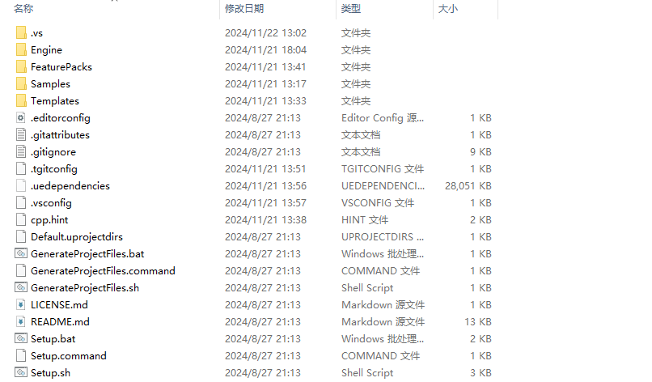
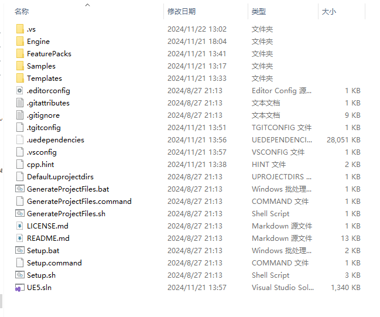
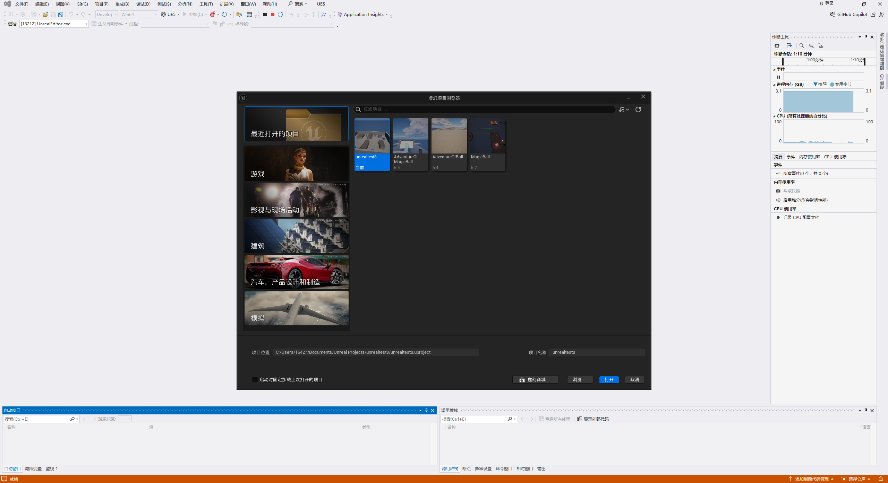
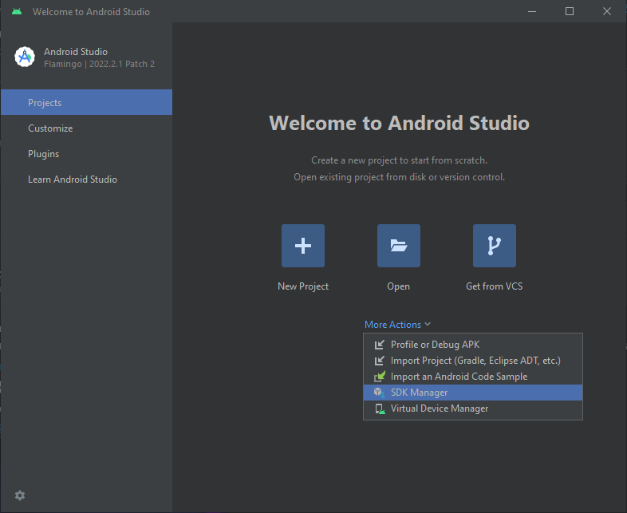
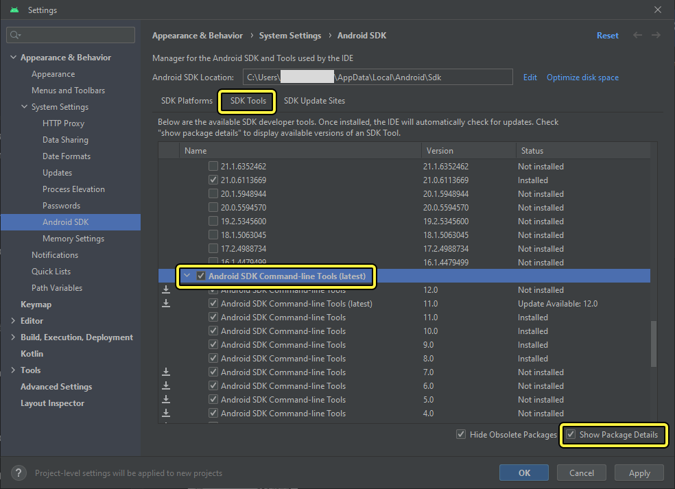

##从源码编译Unreal引擎

#步骤1

将拥有的epic账号绑定github账号，绑定后epic会邀请github账号加入epic组织，然后就可以下载ue源代码了，可以使用gitclone也可以直接下载压缩包（建议下载ue5.4版本），详细步骤见https://dev.epicgames.com/documentation/zh-cn/unreal-engine/downloading-unreal-engine-source-code

#步骤1

解压下载的压缩包，解压后得到的目录如下

先启动Setup.bat下载依赖文件,再启动GenerateProjectFiles.bat构建项目文件,构建完成后目录如下

点击UE5.sln进入项目

进入项目后先把上方的解决方案配置设置为 **开发编辑器**

将解决方案平台设置为 **Win64**

右键单击UE目标并选择 **构建**

初次构建需要较长时间

构建完成后将启动项目设置为 **UE5**。 点击运行即可构建ue5引擎，详细过程参见https://dev.epicgames.com/documentation/zh-cn/unreal-engine/building-unreal-engine-from-source

启动完成后图片如下

##andriod打包

#前置步骤

安装jdk17

#步骤1

在虚幻编辑器中运行turnkey

1.打开 虚幻编辑器（Unreal Editor） 。

2.点击 平台（Platforms） > Android > 安装SDK（Install SDK）

安装完成后，打开Android Studio。

在 欢迎使用Android Studio对话框中，点击 More Actions ，然后点击 SDK Manager

勾选Android SDK Command-Line Tools (latest)，然后点击 Apply 。此操作将下载命令行工具，这些工具是自动配置虚幻引擎Android Studio所必需的。

安装完成后即可打包发布

打包发布到andriod端的图片如下

